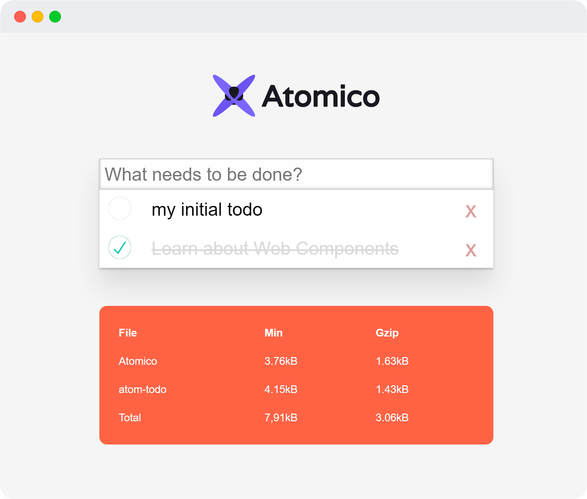

# atomico-todo

Este es un pequeño ejemplo de un componente generado con [**Atomico**](https://github.com/uppercod/atomico) y empaquetado gracias a [**Rollup**](https://rollupjs.org/guide/en).

Como aprendizaje del uso de Atomico lo invito a ver explorar el directorio **/src**

|File|Min|Gzip|
|----|---|----|
|Atomico|	3.76kB|	1.63kB|
|atom-todo|	4.15kB|	1.43kB|
|Total|	7,91kB|	3.06kB|

